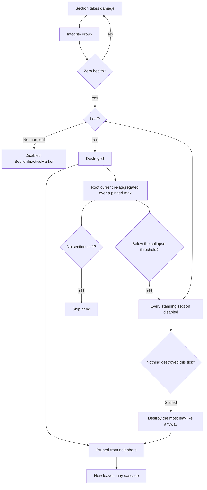

# Spaceship sections and integrity

> To add a new section kind, follow the guide
> [Add a ship section](../guide-add-section/).

Ships are assembled from modular **sections**. Each section is a child entity of
the ship root with its own collider, mass, and health, and contributes one
behavior (structure, thrust, steering, guns). The **integrity** system tracks
how sections connect and handles damage, disabling, and cascading destruction.

## Sections (`nova_ship::sections`)

A section is a `SectionConfig { base: BaseSectionConfig, kind: SectionKind }`.
`BaseSectionConfig` is shared by all kinds: `id`, `name`, `description`, `mass`,
`health`, optional `collider`, structural `link_points`, and `hide_in_editor`.

`SectionKind` variants (one module per kind under `crates/nova_ship/src/sections/`;
`turret_section/` and `torpedo_section/` are directories, not single files):

| Kind         | What it does |
|--------------|--------------|
| `Hull`       | Passive structure/armor. Just a `render_mesh`. |
| `Thruster`   | Forward thrust (`magnitude`); drives the exhaust visual. |
| `Controller` | PD attitude controller (`frequency`, `damping_ratio`, `max_torque`). Also grants flight `verbs` (STOP/GOTO/ORBIT maneuvers plus LOCK targeting and RCS fine-translation). A ship needs one to be drivable; several SHARE one attitude loop (see below). |
| `Turret`     | Aims and fires bullets. An authored joint tree (hinges + muzzles, each joint with its own `offset`/`axis`/`speed`/limits/`render_mesh`), section-wide `muzzle_speed` + authored `bullet_damage` + `bullet_kind`, per-muzzle `fire_rate`, optional `ammo_capacity`. |
| `Torpedo`    | Torpedo bay. Fires guided torpedoes that detonate an Explosive area blast (`blast_radius`, `blast_damage`), optional `ammo_capacity`. |

`GameSections(Vec<SectionConfig>)` is the resource of section blueprints.
Generic prototypes are authored in
`crates/nova_authoring/src/base_content/sections/standard.rs`; semantic craft
parts live under `base_content/ships/`. Their explicit `section_catalog()` is
generated into `assets/base/sections/base.content.ron` by `content -- gen` and
merged into the resource by
`crates/nova_assets/src/merge.rs`. Look one up with
`sections.get_section("basic_thruster_section")`.

### Stacked controllers share one loop

Every live controller torques the hull in parallel, so a hull with several of
them would multiply both its gains and its torque ceiling by the section count.
`update_controller_stack_tuning`
(`crates/nova_ship/src/sections/controller_section.rs`) prevents that: it runs
first in `FixedUpdate` (`ControllerSectionSystems::SyncStack`), derives ONE
ship-level attitude loop per root, and writes each live controller a share of
it into its `PDController`. The authored numbers stay put in
`ControllerSectionTuning`, which is what the pass re-derives from when a
controller dies.

The ship-level loop, for `n` live controllers on the curve
`stack_curve(n, limit) = limit - (limit - 1) / n`:

- torque budget: each controller's authored `max_torque` at its rank weight,
  summing to `stack_curve(n, 2.0)` of the strongest - 1.00 / 1.50 / 1.75 / 1.90
  at n = 1 / 2 / 4 / 10, with a hard ceiling of 2x. Peak angular acceleration
  is `budget / inertia`, and only the numerator is capped, so scale is still
  what decides how a hull turns.
- P gain: DIVIDED by `stack_curve(n, 1.5)`, which lowers the `kp / kd` ratio
  the hull coasts down to its command on - the stack brakes the turn earlier
  and lands on the commanded attitude instead of sailing past it.
- D gain: held at exactly one controller's worth. This is not tuning: `kd * dt`
  crosses 2 at two controllers on the shipped tuning, and past that the PD
  limit-cycles instead of parking (the corkscrew that used to follow a
  released maneuver).

`ship_turn_rate` (`flight/guidance.rs`) then SUMS the live shares, which is why
the flight layer is ordered after `SyncStack`. `n = 1` is the identity case, so
single-controller ships - every shipped hull - are untouched.

### Meshes and colliders (authorable)

Two authorable knobs decouple a section's look and physics from the default unit
cube (`crates/nova_ship/src/sections/base_section.rs`). Unset content still uses
the unit-cube defaults:

- `render_mesh_transform` (optional, on every mesh-bearing kind; for turrets
  it sits per JOINT in the joint tree) - an offset /
  rotation / scale applied to the section's render mesh child ONLY, so a model
  can be re-seated visually without moving the collider or (for turrets) the
  joint tree. Type `RenderMeshTransform`.
- `collider` on `BaseSectionConfig` (optional) - the physics shape:
  `Cuboid { size }`, `Sphere { radius }`, `Capsule { radius, length }`, or
  `Cylinder { radius, height }` (the last three along local Y). `None` resolves
  to the unit cube (`Cuboid { size: (1,1,1) }`) - the shape every section had
  before colliders were authorable. Section mass is `density * collider_volume`,
  so a larger collider is also heavier.

## Building a ship

A `SpaceshipConfig` (`crates/nova_scenario/src/objects/spaceship.rs`) has a
`controller` (`None`, `Player`, or `AI`), an `allegiance`, an optional
`collapse_threshold` (below), and a list of
`SpaceshipSectionConfig`, each placing one section at a `position` + `rotation`
relative to the ship root (world units), with a `source` (`Inline` /
`Prototype`) and optional `modifications`. The player
config carries the input mapping (section id -> key/gamepad bindings) plus
`speed_cap` and `infinite_ammo`; the AI config carries `patrol`/`orbit`/`leash`/`engage_delay`.

Spawning: the base scenario bundle gives the root `RigidBody::Dynamic`; the
spaceship object adds `SpaceshipRootMarker`, and an observer
(`insert_spaceship_sections`) spawns each section as a direct child. Every
section gets `SectionMarker`, its `Collider` (the authored `collider` shape, or
a unit cube by default), `SectionLinkPoints`, `ConnectedTo`, and `Health` (`base_section` in
`sections/base_section.rs`), so the ship is one rigid body whose child colliders
each carry their own health.

See the semantic Racer, CargoA, and CargoB builders under
`crates/nova_authoring/src/base_content/ships/` for complete generated examples.
The editor (`crates/nova_editor`) assembles ships interactively using
`preview_section`, which has no health or rigid body and never enters the
damage pipeline.

## Integrity: damage -> disable -> destroy

The destruction stack is nova's own, in
`crates/nova_gameplay/src/integrity/`, with the ship adapter in
`crates/nova_ship/src/sections/integrity.rs`. `NovaIntegrityPlugin` composes five
generic pieces:

- `health.rs` - the hit-point store: `Health`, `HealthApplyDamage` and the
  `HealthZeroMarker` its observer adds at zero.
- `core.rs` (`IntegrityCorePlugin`) - the generic disable/destroy core, plus
  the mass-times-velocity impact damage.
- Ship-owned `ShipIntegrityPlugin` - derives the section graph, handles disabled
  sections, rolls section health up to the ship root, and collapses a root that
  falls below its `StructuralCollapseThreshold`.
- `explode.rs` - reacts to destruction: debris, mesh fragments, `OnDestroyedEvent`.
- `neutralize.rs` - combat-death: fires `OnNeutralized` when a ship stops
  being a threat.

Graph build: every section prototype authors local `link_points` with an id,
position, and outward unit normal. When avian links a collider to its body
(`ColliderOf`), `ShipIntegrityPlugin` transforms those points into ship-root
space. Coincident points with opposed normals become symmetric `ConnectedTo`
neighbor edges. IDs are for diagnostics and UI, not compatibility. A malformed,
ambiguous, or disconnected graph is rejected as a whole; collider contact and
center distance never create fallback edges. `SpaceshipRootMarker` declares the
body as `IntegrityRoot`. Asteroids declare the same root role and give their lone
collider node an empty list, so it is a leaf.

Editor placement mates the same sockets, so the editor cannot build a ship the
graph would reject. `snap_placement` (`nova_ship::sections::link_points`) poses a
part from one mate: the two sockets become coincident and their normals opposed,
which leaves only the ROLL about that axis free - the builder's choice, alongside
which of the part's own sockets does the mating.

That roll has a defined ZERO, and it is what makes one part usable on every
other part. Each socket carries an implied up vector, `link_point_up(normal)`:
ship up (+Y) projected onto the socket's plane, or forward (+Z) on the sockets
that face +-Y. It is DERIVED from the normal rather than authored, so two parts
that never met agree on it without anyone writing a second vector, and
`snap_placement` mates the two socket FRAMES rather than just the two normals.
Aligning normals alone leaves the roll to whichever axis a shortest-arc rotation
happened to sweep about - and for a socket facing exactly opposite the part's
own, to an arbitrary perpendicular.

The other half is the normals themselves. An authoring tool that derives a
socket from part GEOMETRY gets whatever angle the neighbour happened to sit at,
so `cardinal_axis` snaps the derived normal to the nearest axis. It is
antisymmetric (`cardinal_axis(-d) == -cardinal_axis(d)`), so both ends of one
authored edge stay exactly opposed and no existing mate is lost. Without it the
cargob's pod faced its fuselage 36 degrees off -X and anything mated onto that
socket arrived tilted by exactly that much - which is what made parts look like
they only fit the craft they were cut from.

`box_link_points(size)` is the general face-socket helper
(`unit_cube_link_points` is `box_link_points(Vec3::ONE)`). A part authored at its
own size mates against a part of any other size, because the sockets meet face to
face and the roll comes from the axis alone; `pdc_kinetic_turret_section` (and
its `pdc_pierce_turret_section` twin, the same gun with a different round) is the
shipped example - one compact mount that fits every hull, replacing ten per-craft
copies of the same gun.

`candidate_link_point_mates` is
the same pairing WITHOUT the ambiguity and connectivity gates, because a ship
under assembly is legitimately disconnected; the editor uses it to see which
sockets are taken and to refuse a placement that would leave one with two
suitors. Collider bounds enter only as the overlap refusal, under the ship lint's
rule: interpenetration is allowed exactly where a mate says the interface is
intentional.

`scripts/cut-obj-into-parts.py` proposes candidates for freshly cut parts: two
parts whose bounds meet at a seam and overlap across it get one socket each at
the centre of that shared face, written into the part manifest as `link_points`.
A recipe part can author its own list instead (in ship space, like every other
recipe coordinate), which replaces the generated one. They are candidates for a
human to judge - shipped gameplay sockets stay hand-authored in `nova_authoring`.

Damage flow:

1. A hit triggers `HealthApplyDamage` (`nova_gameplay::integrity::health`);
   its observer subtracts the amount and adds `HealthZeroMarker` at zero. The amount also bubbles up `ChildOf`, clamped to
   what the section actually had left - so overkill on one section cannot kill
   the ship (a 1000 hit on a 100 hp section costs the root 100).
2. Zero health -> `IntegrityDisabledMarker`. A disabled non-leaf section is only
   deactivated (`SectionInactiveMarker`); a disabled **leaf** is destroyed.
3. Destruction prunes the node from its neighbors' lists, which can create new
   leaves and cascade: shooting off the structure collapses what hung from it.
4. `aggregate_ship_health` keeps the root's `current` equal to the sum of its
   living sections, over a `max` that is PINNED - a running maximum, never
   re-derived from the survivors. A destroyed section despawns, so a live
   denominator would make the HP bar fill up as a ship is shot apart (150/1100
   reading 100/100) and would make any fraction of it rebound. It is a running
   maximum rather than a set-once pin because a ship's sections can land across
   several frames.
5. Below its `StructuralCollapseThreshold` (`collapse_threshold` on the ship,
   default 0.25) the root gets `StructuralCollapseMarker` and the ship starts
   TEARING ITSELF APART, rather than dying on the spot: `cascade_structural_collapse`
   disables every section still standing and hands them to steps 2 and 3 above.
   The extremities are leaves, so they go first and burst their debris; the
   prune turns their neighbors into leaves, and those go on the next frames.
   The wreck peels from the outside in instead of vanishing - how long that
   takes is the remnant's DEPTH, so a chain peels from both ends over several
   frames while a shallow remnant whose sections are all already leaves goes in
   one. Every section's own debris burst fires either way.
6. The ROOT dies last, and of the same rule. Each destroyed section leaves the
   sum, so step 4 walks `current` down to zero on its own; with no structure
   left the recompute marks the root `HealthZeroMarker` and the ordinary chain
   destroys it, which is what fires `OnDefeated`/`OnDestroyed`. That is also
   the standalone backstop for a last section removed WITHOUT a damage bubble
   (a direct destroy, a detach), which nothing else would mark, and it is what
   threshold `0.0` reduces the whole rule to.

**The no-progress override.** Disabling a section costs it no health - only
DESTRUCTION takes it out of the root's sum - so a remnant with no leaf never
drains. Four hulls mated in a ring each keep two neighbors, none ever becomes a
leaf, nothing is destroyed, `current` never falls and the root never dies: an
immortal disabled hulk. So the leaf rule is treated as a preference for the
ORDER a wreck comes apart in, not a correctness requirement. A cascade tick
that disables nothing new AND does not see the standing-section count fall is a
stall, and the most leaf-like survivor is destroyed whatever its neighbors.
Breaking one node out of a ring leaves a chain, so the ordinary cascade
resumes and the peel is kept everywhere it is possible. Progress is measured as
that count FALLING rather than against a frame budget, because the cascade's own
gaps are irregular while a count that fell is direct evidence a section died.

A ship is disabled progressively, so a collapsing ship can keep shooting for a
few frames; its weapons stop as their own sections go. That also means the
unified defeat edge usually comes from `neutralize.rs` partway through the
peel, and the root's later destruction fires only `OnDestroyed` - `DefeatedMarker`
is what keeps `OnDefeated` to exactly one.

Structural collapse is a MATERIAL test and stands apart from neutralization
(`neutralize.rs`), which is a CAPABILITY test: a ship can be out of the fight
with a sound hull (a derelict to board, salvage or let limp away), and a ship
can collapse while its guns still work.

The cascade a single section walks through:

## Typed damage (`crates/nova_gameplay/src/damage.rs`)

Weapon damage is authored, not emergent from bullet physics, and it is ONE
number: there is no resistance table and no per-section multiplier anywhere in
the damage path. A projectile carries
`ProjectileDamage { amount, power, layers, kind }` with a `DamageType`:
`Kinetic`, `Pierce`, or `Explosive`. `apply_damage` is the single point at which
any weapon enters the health store, and it is a plain `HealthApplyDamage`
trigger - nothing between the weapon and `on_damage` reinterprets the number.

A type is a way of TRAVELLING, not a multiplier. That was the point of dropping
the table: a round visibly crossing three sections is legible from the cockpit,
a 1.5x is not. `SectionClass` survives the table as the ship computer's section
LABEL (`nova_os_ui` reads it for codes, glyphs and descriptions); nothing in the
damage path branches on it.

Turret bullets are given a near-zero physical mass (`NEUTRALIZED_BULLET_MASS`)
so the impact path's mass-times-velocity damage
(`on_impact_collision_deal_damage`, `integrity/core.rs`) is negligible and the
authored amount is the only weapon damage. Torpedoes detonate a `NovaBlast`
(linear falloff, `damage.rs`) which damages every overlapping collider - no
occlusion, no layering: nothing gives cover against a blast, which is what
makes torpedoes the counter to armour a bullet cannot rake through.

### Closing speed

Both BULLET types are speed-driven, and the term is computed at the hit, not at
the muzzle: `closing_speed(round_velocity, target_velocity)` projects the same
relative velocity `on_impact_collision_deal_damage` uses onto the round's own
line of flight (projecting onto the line BETWEEN the bodies is unusable - at
contact they are touching, so that direction is noise). Both curves are the
speed ratio against `REFERENCE_CLOSING_SPEED` (100 u/s, the shipped PDC's
`muzzle_speed`), clamped:

- `kinetic_damage_multiplier` scales what a hit DEALS, clamped to `[0.25, 2.0]`;
- `pierce_power_multiplier` scales how far the round GETS - it divides what a
  layer costs - clamped to `[0.5, 3.0]`.

Linear, not the ram model's own curve: `impact_damage` is impulse plus absorbed
energy, and at bullet speeds the quadratic energy half reads ~3.9x at twice the
reference, which would turn a ~400 DPS PDC into ~1600. Both read exactly 1.0 at
the reference, so authored `bullet_damage` values keep the feel they were tuned
for. Speed scaling is deliberately NOT in `apply_damage`: a ram already carries
its velocity in the amount, and a blast has no line of flight.

### The travel rule

`pierce_remainder` (`damage.rs`) is the whole rule, one branch per type;
`spend_piercing_damage` deals `hit_bite` through `apply_damage` and then calls
it.

- KINETIC spends its DAMAGE. `amount` doubles as the budget: a hit that fails to
  destroy the target has by definition put the whole bite into it, so the round
  dies; a hit that destroys it costs only the health that was there, priced back
  through the speed curve that scaled the bite, and the rest flies on. A slug
  can never deal more in total than it was fired with.
- PIERCE spends POWER, never damage. `amount` is flat - the same bite into every
  layer, no speed term and no decay with depth. Crossing a layer costs that
  layer's `Health.max` divided by `pierce_power_multiplier`. MAX, not remaining,
  for two reasons: light plating stays nearly free while a heavy block is
  expensive (the spaced-armour intuition), and softening a section with other
  fire cannot open a cheaper hole through it. A rake's TOTAL damage therefore
  exceeds what it was fired with, which is intended. `PIERCE_BASE_POWER` (300 hp
  of thickness) is the budget and `MAX_PIERCE_LAYERS` (6) the backstop under it,
  because cheap plating alone would not bound the chain.

A target with no `Health` on the hit collider (an asteroid, a planetoid, a pool
that lives on an ancestor) has no thickness to price and nothing provably
destroyed, so it is a wall to both types at any speed. Nothing in the rule knows
what it hit, so destructible cover needs no special case. Torpedoes do not use
it - they detonate on a proximity fuze.

One avian trap the hit callsite has to handle: `CollisionStart` is raised once
per EVENT-ENABLED collider, so a contact with events on both sides arrives
twice with `collider1`/`collider2` swapped. An asymmetric rule must act on one
ordering only (`resolve_bullet_hit` keys on the round being named first;
`on_nova_blast_collision` on the blast being `body1`), or it pays out twice
per contact. A symmetric rule - ram damage - wants both.

## Ammo

- `SectionAmmo` (`sections/ammo.rs`): optional magazine on a weapon section.
  Absent = unlimited fire; `ammo_capacity` in the turret/torpedo config opts in.
  The player `infinite_ammo` flag builds that ship's weapons without magazines.
- `SectionReload` (`sections/ammo.rs`): optional auto-reload/regen on a magazine,
  from the turret/torpedo config `reload`. `tick_section_reload` (FixedUpdate)
  refills a spent magazine on a timer - discrete reload-to-full on empty
  (`only_when_empty`, `rounds_per_cycle = capacity`) or continuous per-round
  regen. Add-only vs the fire path's consume, so no ordering is needed. Only a
  weapon that has a magazine can reload, so unlimited weapons never do. Its
  `progress()` is what the diegetic ammo readout draws a reload state from.
- `LoadedBullet` (`sections/turret_section/mod.rs`): the turret's loaded-round slot
  (damage type + amount), seeded from the config. Fired bullets and the HUD ammo
  readout colors read this slot, so swapping ammo types is one component write.
